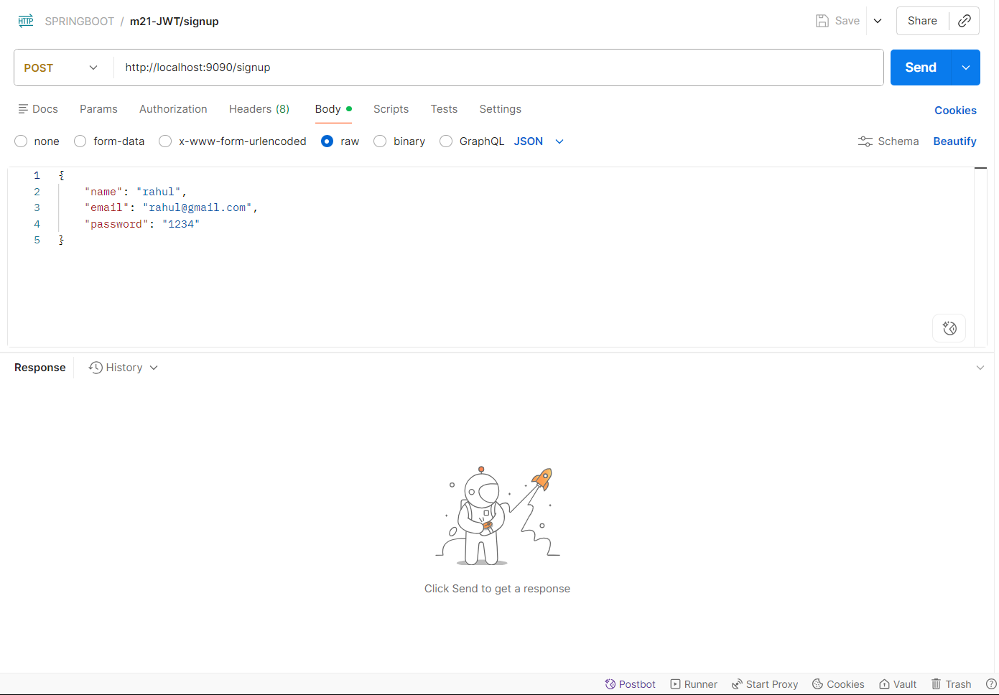
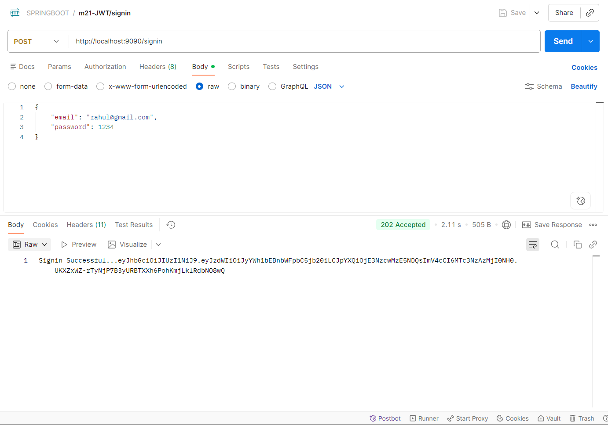
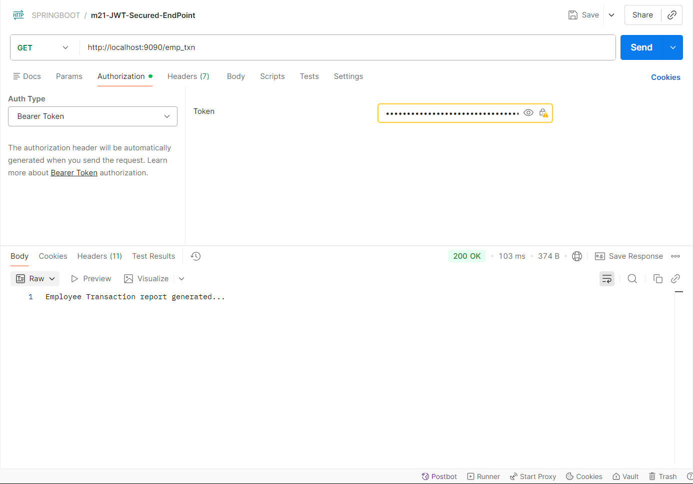

# Spring Boot JWT Authentication API

A secure backend application built using **Spring Boot** and **Spring Security** that implements **JWT (JSON Web Token) based authentication and authorization**.
This project demonstrates user signup, login, and access to protected REST APIs using stateless sessions.

---

## Features

* User Registration (Signup)
* Secure Login (Signin)
* JWT Token Generation
* Token Validation using Custom Filter
* Protected REST APIs
* Stateless Authentication (No Session)
* Password Encryption using BCrypt
* MySQL Database Integration

---

## Tech Stack

* **Backend:** Spring Boot, Spring Security
* **Database:** MySQL
* **Authentication:** JWT (io.jsonwebtoken)
* **Build Tool:** Maven
* **Java Version:** 17

---

## Project Structure

```
com.isrdc
│
├── configs        → Security configuration
├── entities       → Entity classes (Employee)
├── filters        → JWT Filter (AppFilter)
├── jwts           → JWT Utility (JwtService)
├── repos          → Repository layer
├── rests          → REST Controllers
├── services       → Business logic
```

---

## Setup Instructions

### 1️ Clone the Repository

```bash
git clone https://github.com/your-username/springboot-jwt-authentication.git
cd springboot-jwt-authentication
```

---

### 2️ Configure Database

Update your `application.yml`:

```yml
spring:
  datasource:
    url: jdbc:mysql://localhost:3306/m21jwtdb
    username: your_username
    password: your_password
```

---

### 3️ Run the Application

```bash
mvn spring-boot:run
```

Application will start at:

```
http://localhost:9090
```

---

## API Endpoints

### Signup (Create Account)

```
POST /signup
```

**Request Body:**

```json
{
  "name": "Nayan",
  "email": "nayan@gmail.com",
  "password": "1234"
}
```

---

### Signin (Login)

```
POST /signin
```

**Response:**

```
JWT Token
```

---

### Protected API

```
GET /emp_txn
```

**Header Required:**

```
Authorization: Bearer <JWT_TOKEN>
```

---

## JWT Details

* Token validity: **5 minutes**
* Algorithm: **HS256**
* Contains: Username (email) as subject

---
## Screenshots (API Testing with Postman)

### 1. Signup – Create New Account


---

### 2. Signin – Get JWT Token


---

### 3. Access Protected Endpoint (/emp_txn)


---

## Security Notes

* Do not hardcode secret keys in production
* Use environment variables (`.env`) for sensitive data
* Always encrypt passwords before storing

---

## Future Enhancements

* Refresh Token Implementation
* Role-Based Authorization (Admin/User)
* Frontend Integration (React)
* Docker Deployment

---

## Author

**Nayan**
Aspiring Backend Developer

---

## If you found this project useful, give it a star!
